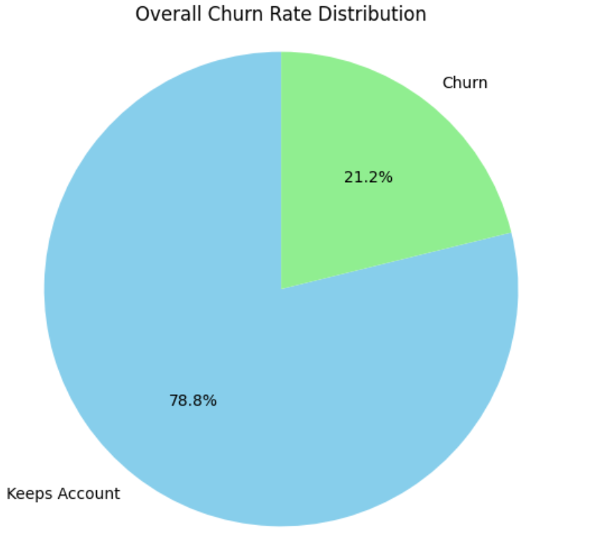
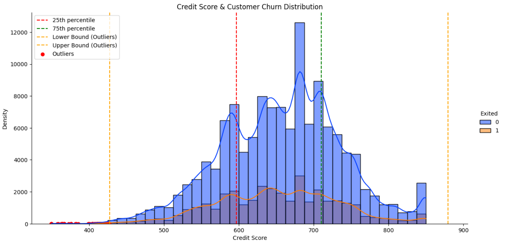
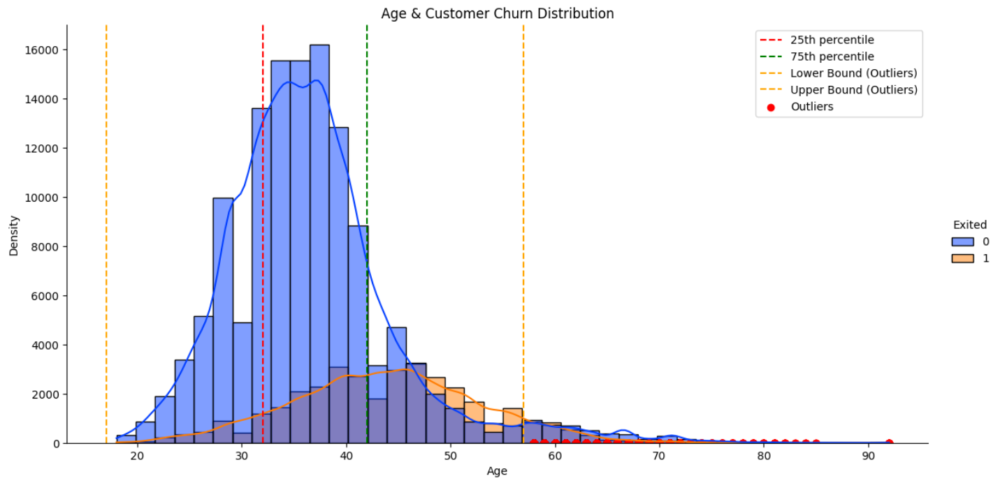
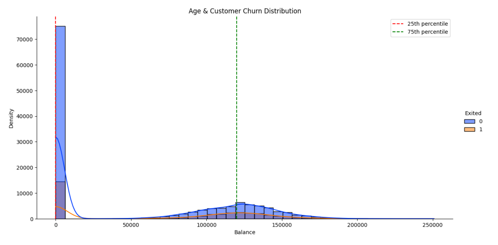
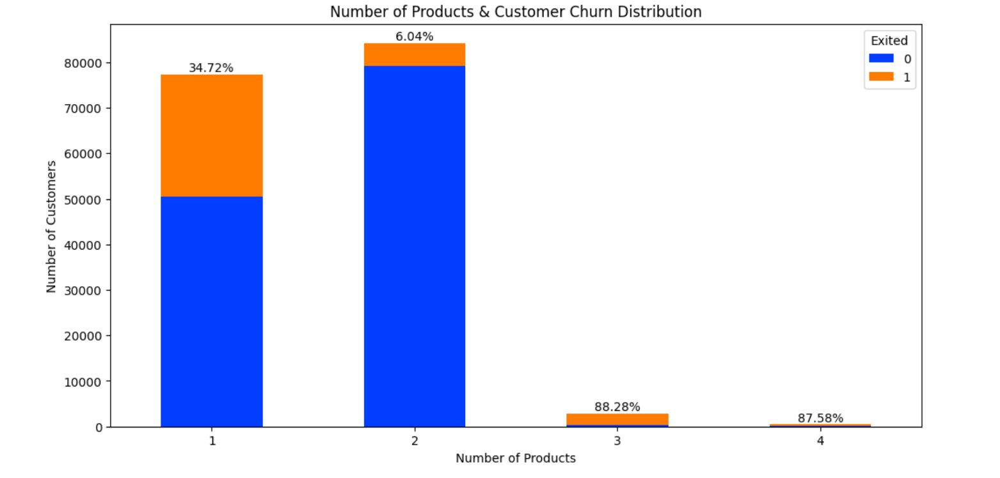
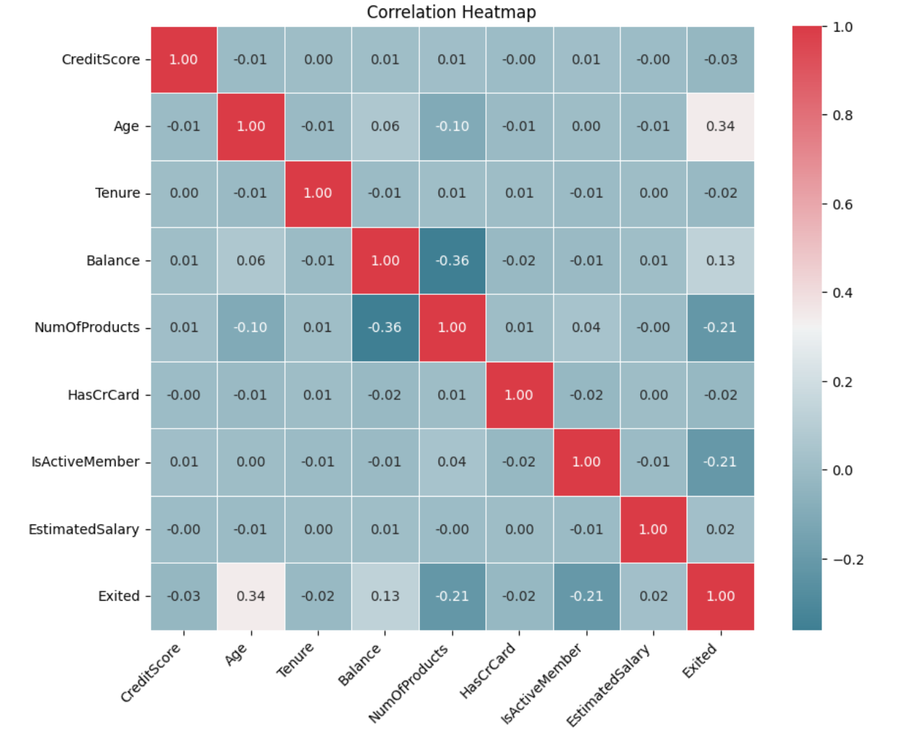
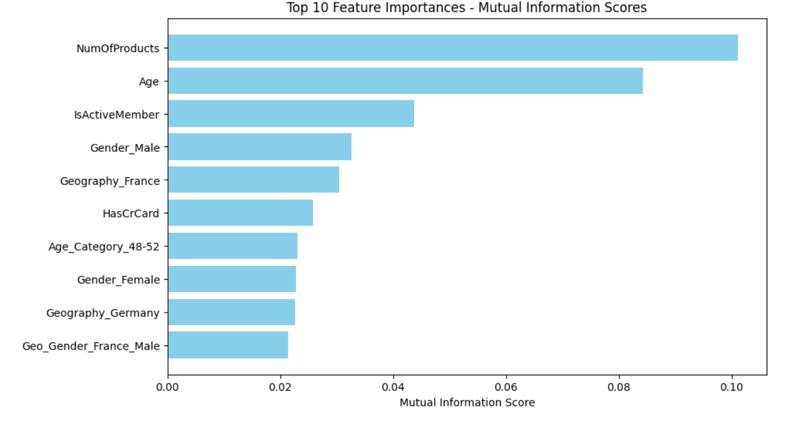
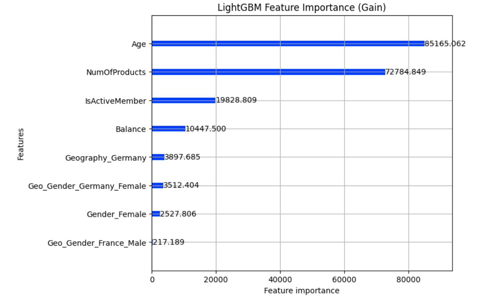
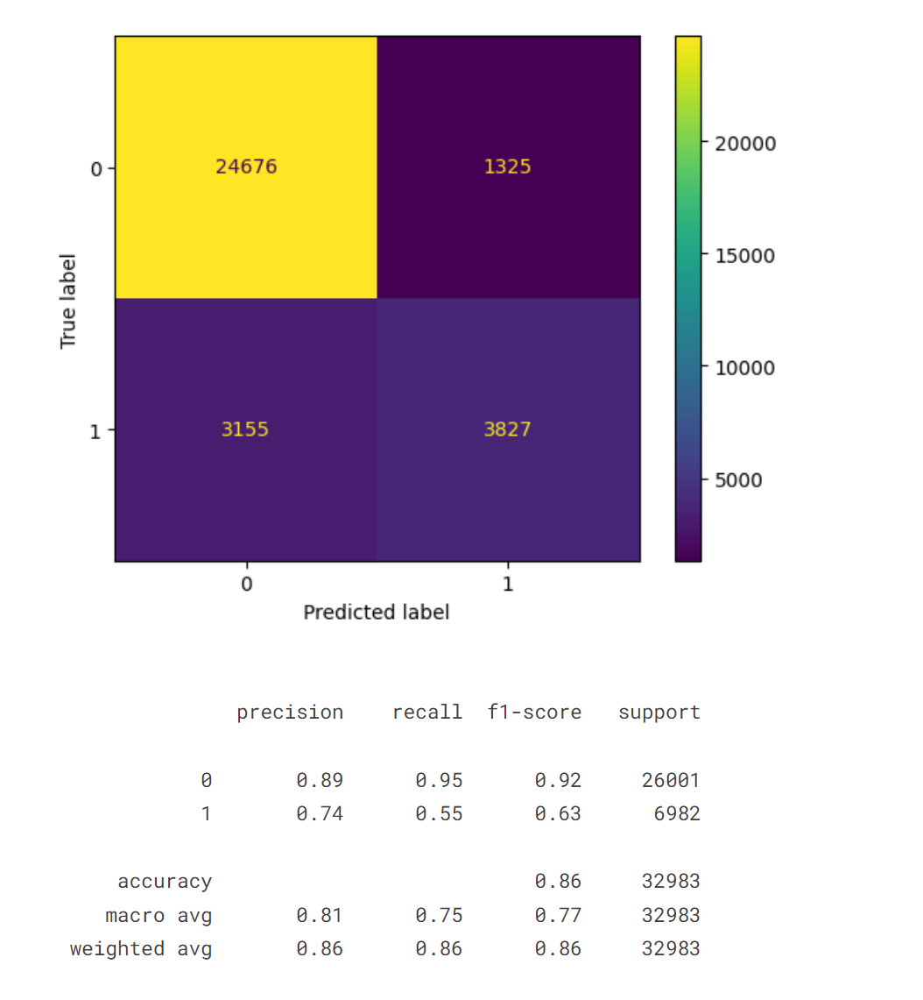
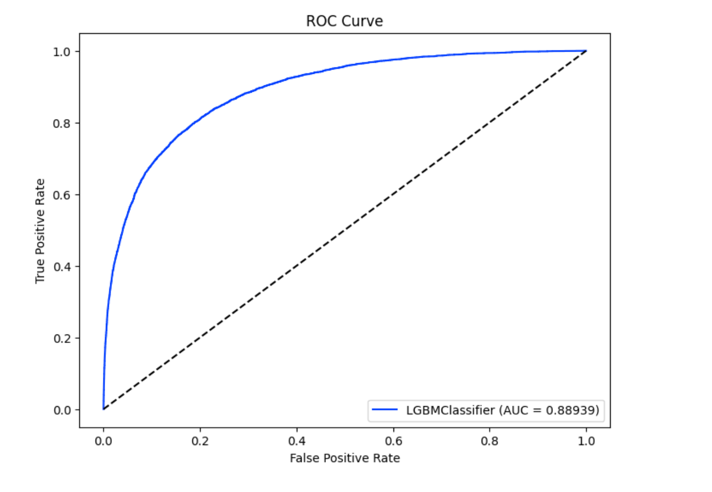

# BANK CHURN CLASSIFICATION 🗞️

    

This repository hosts a notebook featuring an in-depth analysis of a **binary classification** with a bank churn dataset. The notebook contains the following structure

- Executive Summary
- Data Cleansing
- Univariate and Bivariate Analysis
- Feature Extraction 
- Preprocessing
- Baseline Model: LGBMClassifier
- VotingClassifier: LGBMClassifier, XGBoostClassifier, and CatBoostClassifier

The dataset used has been downloaded from this [Kaggle](https://www.kaggle.com/competitions/playground-series-s4e1/data) competition. Feel free to ⭐ and clone this repo 😉

## 👨‍💻 **Tech Stack**

## 📄 **Executive Summary**

The dataset used for this project contains around 165'000 values with few duplicates and no missing data, which makes it easy to handle. Three features (`id`, `Surname`, `CustomerId`) have been considered as irrelevant, as they only contain unique values in each column and no correlation can be found with the target feature (`Exited`)

Only the credit score and the age of the people show outliers, mainly people with low credit score and people older than 60. It is also interesting that around half of the people do not have money (Balance) in their account, which makes the distribution unbalanced, also considering that only **21 % of the people has churned**. This has required some feature engineering and preprocessing. 

The group that tends to churn more are people from Germany, non active members, women, people with more than 2 products and older people. For the geographical and gender feature it was decided to create an additional feature combining both, which has increased the correlation with the target, especially considering that the highest Pearson correlation can be seen in the age (0.34) and it is not very high. However, the **age, number of products and active membership has remain as the most important features for the models**.

For the models, an **AUC of 0.89** was achieved, combining **CatBoost**, **XGBoost** and **LightGBM**, being this three the ones that alone showed the best performance. 

<u><b>Future Improvements:</b></u>

- Feature extraction has shown to increase the correlation with the churn. This possibility can be further explored and create additional features.

- Adding more data of people who churned can be also helpful as oversampling would oly overfit the model adding duplicated features and undersampling would reduce the data to 20% of the original data.

- Trying other models or hyperparameter tuning can be also helpful to get better results. However, a GridSearch over LightGBM was carried out and no improvements could be seen. 

- Better analysing the feature importance using permutation importance or SHAP
  
- Eliminating features that can lead to an AUC reduction
  
## 👨‍🔬 Exploratory Data Analysis

The first step of the project involved a comprehensive analysis of the dataset, including its columns and distribution. The idea was to identify correlations, outliers and the need to perform feature engineering. 

The train dataset contains information on bank customers who either left the bank or continue to be a customer (target column Exited). There are in total 14 columns, mostly numerical with 3 categorical columns:

- `CustomerId`: A unique identifier for each customer

- `Surname`: The customer's surname or last name

- `CreditScore`: A numerical value representing the customer's credit score

- `Geography`: The country where the customer resides (France, Spain or Germany)

- `Gender`: The customer's gender (Male or Female)

- `Age`: The customer's age.

- `Tenure`: The number of years the customer has been with the bank

- `Balance`: The customer's account balance

- `NumOfProducts`: The number of bank products the customer uses (e.g., savings account, credit card)

- `HasCrCard`: Whether the customer has a credit card (1 = yes, 0 = no)

- `IsActiveMember`: Whether the customer is an active member (1 = yes, 0 = no)

- `EstimatedSalary`: The estimated salary of the customer

- `Exited`: Whether the customer has churned (1 = yes, 0 = no)

### 📊 Labels Distribution

The labels distribution showed that the target variable is not well-balanced, representing churn rate only 21% of the samples. This required to set a threshold on the modelling in order to avoid too many FN and FP. Oversampling was tested and led to overfitting, because the samples created were duplicates and undersampling did not improved the model performance.

    

### 📈 Features Distribution
The feature distribution revealed that `CreditScore` and `Age` showed a significant amount of outliers and 50 % of the clients had a `Balance`, which represents the amount of money in the account, of 0. 

    

    

    

People with 3 and 4 products show the higher churn rate with 88 %, but it only represents 2 % of the clients. On the other hand people with only 1 product have the higher churn rate specific weight as it accounts for 46 % of all churns and 34 % within it distribution group.

People with 2 products only churn by 6 %, representing the most stable group.

    

### 🔢 Correlation

`Age`, `NumOfProducts`, `Balance` and `isActiveMember` are the only ones correlated with the target, although the correlation, 0.34 for age is not very high. This meant that we performed feature engineering to identify the most impactful features for the models.

    

## 📳 Feature Engineering

Due to the fact that the majority of the data are not symmetrically distributed or showed a classification distribution the following new features were created:

- `Age_Category`: grouping `Age` in bins of 5 years
- `Salary_Category`: grouping `EstimatedSalary` in bins of 10'000 USD
- `Balance_Class`: creating a category (0,1), whether it has money in the account or not
- `Geo_Gender`: grouping `Geography` with Gender

Afterwards mainly two methodologies were used to check the feature importance for specific models:

-  **Mutual Info Classification**: This method basically utilizes mutual information. It calculates the mutual information value for each of the independent variables with respect to the dependent variable and selects the ones which have the most information gain. In other words, it basically measures the dependency of features with the target value. A higher score means more dependent variables.

- **Feature Importance from Models**: classification models have a function that allow to extract the feature importances once the model has been fitted. This was tried out with Random Forest, CatBoost and LightGBM.

`SelectFromModel` function from sklearn was also tested but this mainly has the same attributes as the feature selection function from the models.

Adding additional features to the dataset, like combining geography with gender, or grouping the age every 5 years, has shown that by performing feature importance, some of these features are on the top 10 features for specific models, like Geography_Germany or Age_Category_48_52

    

    

    

## 🪙 Modeling

In order to train the models some preprocessing steps in our features was performed, mainly:

- RobustScaler on the numerical features with outliers
- MinMaxScaler on the other numerical features
- OneHotEncode on the categorical features

The modeling involved training 6 models ("RandomForestClassifier", "AdaBoostClassifier", "GradientBoostingClassifier", "XGBoostClassifier", "LGBMClassifier", "CatBoostClassifier"). All models showed very good performances with and without feature engineering above 0.87 AUC (metric used for the competition). The best performing model was LGBMClassifier with an AUC of 0.88939. 

    

    

A grid search over the LightGBM was carried out which did not provided a significant improvement. Afterwards a VotingClassifier ("XGBoostClassifier", "LGBMClassifier", "CatBoostClassifier") was performed, which led to an increase of the AUC to 0.8905

### 🥇 Model Performance Evaluation

All models demonstrated impressive performance, consistently achieving high AUC. Considering that the best model in the competition achieved an AUC of 0.9, the possibilities of improvement are not very wide. 
