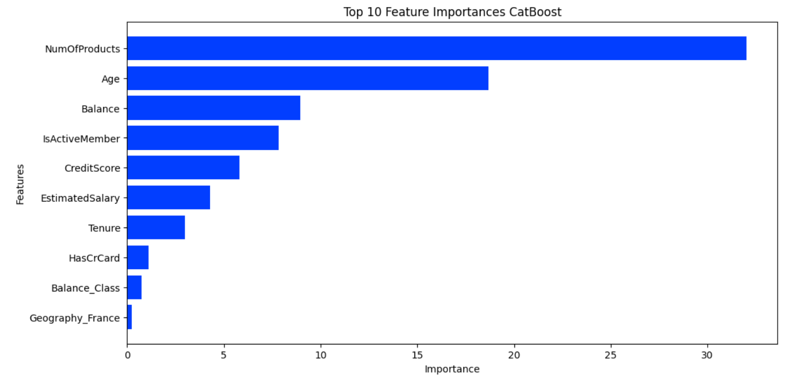

# BANK CHURN CLASIFFICATION 🗞️

    

This repository hosts a notebook featuring an in-depth analysis of a **binary classification** with a bank churn dataset. The notebook contains the following structure

- Executive Summary
- Data Cleansing
- Univariate and Bivariate Analysis
- Feature Extraction 
- Preprocessing
- Baseline Model: LGBMClassifier
- VotingClassifier: LGBMClassifier, XGBoostClassifier, and CatBoostClassifier

The dataset used has been downloaded from the this [Kaggle](https://www.kaggle.com/competitions/playground-series-s4e1/data) competition.

## 👨‍💻 **Tech Stack**

## 👨‍🔬 Exploratory Data Analysis

The first step of the project involved a comprehensive analysis of the dataset, including its columns and distribution. The idea was to identify correlations, outliers and the need to perform feature engineering. 

The train dataset contains information on bank customers who either left the bank or continue to be a customer (target column Exited). There are in total 14 columns, mostly numerical with 3 categorical columns:

- `CustomerId`: A unique identifier for each customer

- `Surname`: The customer's surname or last name

- `CreditScore`: A numerical value representing the customer's credit score

- `Geography`: The country where the customer resides (France, Spain or Germany)

- `Gender`: The customer's gender (Male or Female)

- `Age`: The customer's age.

- `Tenure`: The number of years the customer has been with the bank

- `Balance`: The customer's account balance

- `NumOfProducts`: The number of bank products the customer uses (e.g., savings account, credit card)

- `HasCrCard`: Whether the customer has a credit card (1 = yes, 0 = no)

- `IsActiveMember`: Whether the customer is an active member (1 = yes, 0 = no)

- `EstimatedSalary`: The estimated salary of the customer

- `Exited`: Whether the customer has churned (1 = yes, 0 = no)

### Labels Distribution

The labels distribution showed that the target variable is not well-balanced, representing churn rate only 21% of the samples. This required to set a threshold on the modelling in order to avoid too many FN and FP.

    

### Features Distribution
The feature distribution revealed that `CreditScore` and `Age` showed a significant amount of outliers and 50 % of the clients had a `Balance`, which represents the amount of money in the account, of 0. 

    

    

    

People with 3 and 4 products show the higher churn rate with 88 %, but it only represents 2 % of the clients. On the other hand people with only 1 product have the higher churn rate specific weight as it accounts for 46 % of all churns and 34 % within it distribution group.

People with 2 products only churn by 6 %, representing the most estable group.

    

### Correlation

`Age`, `NumOfProducts`, `Balance` and `isActiveMember` are the only ones correlated with the target, Although the correlation, 0.34 for age is not very high. This means that we will have to perform feature selection to chose the best features for our model.

    

## Feature Engineering

Due to the fact that the majority of the data are not simetrically distributed or showed a classification distribution the following new features were created:

- `Age_Category`: grouping `Age` in bins of 5 years
- `Salary_Category`: grouping `EstimatedSalary` in bins of 10'000 USD
- `Balance_Class`: creating a category (0,1), whether it has money in the account or not
- `Geo_Gender`: grouping `Geography` with Gender

Afterwards mainly two metodologies were used to check the feature importance for specific models.-

-  **Mutual Info Classification**: This method basically utilizes mutual information. It calculates the mutual information value for each of the independent variables with respect to the dependent variable and selects the ones which have the most information gain. In other words, it basically measures the dependency of features with the target value. A higher score means more dependent variables.

- **Feature Importance from Models**: classiffication models have a function that allow to extract the feature importances once the model has been fitted. This was tried out with Random Forest, CatBoost and LightGBM.

^SelectFromModel` function from sklearn was also tested but this mainly has the same attributes as the feature selection function from the models.

Adding additional features to the dataset, like combining geography with gender, or grouping the age every 5 years, has shown that by performing feature importance, some of these features are on the top 10 features for specific models, like Geography_Germany or Age_Category_48_52

    

    

    

## 👨‍🔬 Modeling

The project involved training 4 models with varying configurations using Spark, Sklearn and feature engineering. All models showed very good performances with and without feature engineering (scaling and feature selection). The results are summarized below (confusion matrix belong to the baseline model Sklearn Random Forest):

    

- Sklearn Random Forest: 96 % and only 4 false negatives
- Sklearn Random Forest + Feature Selection: 94 % and only 6 false negatives
- Spark Random Forest: 97% and only 4 false positives
- Spark Random Forest + Feature Selection: 93% and only 9 false positives and 2 false negatives

### Model Performance Evaluation

All models demonstrated impressive performance, consistently achieving high accuracies, frequently surpassing the 90% mark and low amount of FN/FP. 
